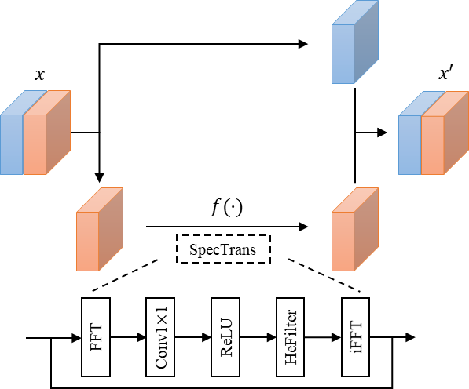

# Spectral Hint GAN

<!-- [](https://colab.research.google.com/github/SHI-Labs/FcF-Inpainting/blob/main/colab/FcF_Inpainting.ipynb) [](https://huggingface.co/spaces/shi-lab/FcF-Inpainting)  -->
[](https://pytorch.org/) 
[](https://opensource.org/licenses/Apache-2.0)

This repo hosts the official implementary of:

[Xingqian Xu](https://ifp-uiuc.github.io/), Shant Navasardyan, Vahram Tadevosyan, Andranik Sargsyan, Yadong Mu and [Humphrey Shi](https://www.humphreyshi.com/home), **Image Completion with Heterogeneously Filtered Spectral Hints**, [Paper arXiv Link](https://arxiv.org/abs/2211.03700).

## News

- [2022.11.12]: Evaluation code and pretrained model released.
- [2022.11.07]: Our paper is accepted in WACV23.
- [2022.11.06]: Repo initiated.

## Introduction

<p align="center">
  
</p>

Spectral Hint GAN (**SH-GAN**) is an high-performing inpainting network enpowered by CoModGAN and novel spectral processing techniques. SH-GAN reaches state-of-the-art on FFHQ and Places2 with freeform masks.

## Network and Algorithm

The overall structure of our SH-GAN shows in the following figure:

<p align="center">
  
</p>

The sturcture of our Spectral Hint Unit shows in the following graph:

<p align="center">
  
</p>

Heterogeneous Filtering Explaination: 
<p style="font-size:9pt">
<ul>
  <li>1x1 Convolution in Fourier domain leads a uniform (homogeneous) transform from one spectral space to another.</li>
  <li>ReLU in Fourier domain is like a value-dependend band pass filter that zero out some frequency values.</li>
  <li>We promote the **heterogeneous transforms** in spectral space, in which the frequency value transformations are depended on the frequency bands.</li>
</ul>
</p>

<p align="center">
  
</p>

Gaussian Split Algorithm Explaination:

Gaussian Split is a spectral space downsampling method that well-suit deep learning structures. A quick intuition is that it likes Wavelet Transform that can pass information in different frequency band to its corresponding resolution.

<p align="center">
  
</p>

## Data

We use FFHQ and Places2 as our main dataset. Download these dataset from the following official link: [FFHQ](https://github.com/NVlabs/ffhq-dataset), [Places2](http://places2.csail.mit.edu/)

Directory of FFHQ data for our code:

```
├── data
│   └── ffhq
│       └── ffhq256x256.zip
│       └── ffhq512x512.zip
```

Directory of Places2 data for our code:

* Download the data_challenge.zip from Places2 official website and decompress it to /data/Places2
* Same for val_large.zip

```
├── data
│   └── Places2
│       └── data_challenge
│           ...
│       └── val_large
│           ...
```

## Setup

```
conda create -n shgan python=3.8
conda activate shgan
conda install pytorch==1.8.0 torchvision==0.9.0 torchaudio==0.8.0 cudatoolkit=11.1 -c pytorch -c conda-forge
pip install -r requirement.txt
```

## Results and pretrained models


## Evaluation

coming soon

## Training

coming soon

## Citation

```
@inproceedings{xu2022image,
  title={Image Completion with Heterogeneously Filtered Spectral Hints},
  author={Xingqian Xu, Shant Navasardyan, Vahram Tadevosyan, Andranik Sargsyan, Yadong Mu, and Humphrey Shi},
  booktitle={WACV},
  year={2023}
}
```

## Acknowledgement

Part of the codes reorganizes/reimplements code from the following repositories: [Comodgan official Github](https://github.com/zsyzzsoft/co-mod-gan) and [Stylegan2-ADA official Github](https://github.com/NVlabs/stylegan2-ada-pytorch/).
